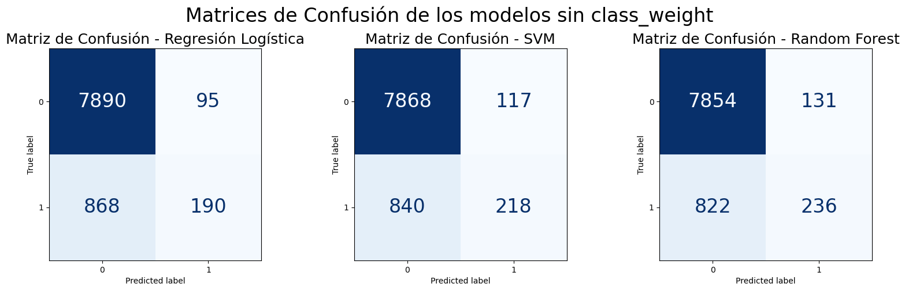
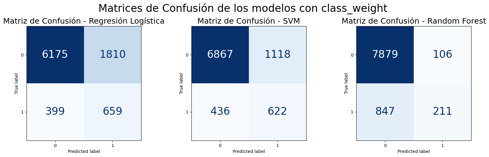
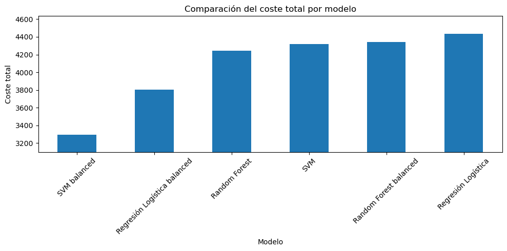

## 1. Introducción
- Contexto del problema:
    - El problema en este caso pertenece a uno de clasificación y pertenece a aprendizaje supervisado. En este caso, se busca predecir si un cliente contratará o no un depósito a plazos después de una campaña de marketing

    - En base al dataset que se ha escogido y a los temás que se han propuesto, he decidido que voy a escoger el tema número 4: **Análisis de costes de error a partir de la matriz de confusión**. Este tema es adecuado, debido a la naturaleza del dataset, porque hay que tener en cuenta que no todos los errores tienen la misma importancia, ya que no es lo mismo contactar con un cliente que no esta interesado, que no contactar con un cliente que si está interesado.

- Objetivos del trabajo 
    - El objetivo de este trabajo es analizar los costes de error en base a los resultados que se ven en las matrices de confusión de los distintos modelos. 
    
    - Para ello, se analizarán los distintos modelos y se llegará a conclusiones de cual es el modelo óptimo para este dataset. Para elegir el mejor, vamos a analizar el número de falsos positivos y falsos negativos, antes que cualquier otra métrica general como el accuracy.

    - En este contexto, un falso negativo indica un cliente que el modelo predice como no interesado, pero que realmente sí contrató el depósito. Esto es grave debido a que es pérdida de ganancias para el banco. Por otro lado el falso positivo indica lo contrario, el modelo dice que un cliente contrata el depósito cuando realmente no está interesado.

## 2. Descripción del dataset
- Origen y características
    - En mi caso voy a utilizar el dataset de Bank Marketing, ya que este dataset contiene datos reales los cuales provienen de campañas de marketing. 
    
    - Este dataset se ha obtenido de la UCI Machine Learning Repository, el cual es un repositorio de datasets muy conocido en ML. Este dataset cuenta con 17 columnas, de las cuales 16 son características y una de ellas es la variable objetivo, llamada "term_deposit". Este dataset cuenta con más de 45k filas, lo cual es una buena base para entrenar modelos de clasificación.

    - Aparte, este dataset cumple con los requisitos del enunciado, ya que cuenta con más de 1000 filas, es un dataset real y cuenta con una variable objetivo clara.
  
    [Bank Marketing - Dataset](https://archive.ics.uci.edu/dataset/222/bank+marketing) 

- Distribución de clases
    - Este dataset cuenta con dos clases, las cuales se encuentran dentro de la columna objetivo, la cual se llama "term_deposit". Esta columna tiene dos valores, "yes" y "no". 
    
    - La clase "yes" indica los clientes que si han contratado el deposito a plazos y la clase "no" indica a los clientes que no contrataron el depósito a plazos.
    
    - En este caso, la clase "yes" es la clase minoritaria, ya que solo es el 11.7% del total, mientras que el 88.3% pertenece a "no". 

    - Esto da lugar, a que este dataset es un dataset desbalanceado, lo cual puede afectar al rendimiento de los modelos de clasificación.

## 3. Preparación del dataset
- Limpieza y transformaciones
    - En este caso, voy a usar el dataset mas amplio, el cual se llama **bank-full.csv**. El cual es el dataset mas completo con todas las características y también cuenta con el mayor número de características.

    - En primer lugar, deberemos de analizar el dataset, para poder ver que variables tenemos y que valores tienen, para ello nos vamos a ayudar de las funciones de ``pandas``.

    - Luego, deberemos de tratar las características las cuales son object, es decir, las que son strings deberemos de convertirlas a números, ya que es algo obligatorio para poder entrenar modelos. Para ello, voy a usar la función ``get_dummies``, aunque también se podría hacer con ``OneHotEncoder``.

    - También hay que tener en cuenta, que hay que borrar la variable ``duration``, ya que indica la duración de la llamada, lo cual no tiene sentido, ya que el objetivo del modelo es decidir antes de llamar a qué clientes pueden estar interesados en la contratación del deposito a plazos.

- Justificación de decisiones (evitar data leakage)
    - Para evitar el data leakage, voy a realizar dos decisiones con la finalidad de que la evaluación sea mas realista.
        - La primera, es eliminar la columna duración, porque puede aportar mucha información, pero se elimina porque produciría data leakage.
        - La segunda, es ajustar el escalador solo a los datos de entrenamiento.
  
## 4. Modelos de clasificación
- Modelos implementados
    - En mi caso, respecto los modelos voy a hacer varios modelos de clasificación para ver las diferencias entre sí y poder compararlos y llegar al modelo óptimo. Hay que tener en cuenta que voy a usar dos versiones de los modelos, una primera sin `class_weight` y una segunda con `class_weight="balanced"`
    El modelo óptimo deberá de regirse en base al número de falsos positivos y falsos negativos. Los modelos que utilizaré son los siguientes:
        - Regresión Logística: lo voy a usar porque es un buen modelo para clasificación binaria, luego es muy interpretable debido a que su salida es la probabilidad de pertenecer a una clase y además permite usar `predict_proba`, el cual sirve para ajustar el umbral de decisión.

        - SVM: es un modelo de clasificación el cual busca separar clases usando un hiperplano. Este modelo computacionalmente es muy exigente, pero los resultados son muy buenos cuantas más variables haya.

        - Random Forest: este modelo se basa en árboles de decisión (Decision Trees) y lo voy a usar porque suele alcanzar una accuracy alto. Es un modelo robusto, aunque puede cometer falsos positivos y falsos negativos, por lo que se evalúa mediante la matriz de confusión. Al igual que Regresión Logística, es muy fácil de interpretar.
        
- Uso de `class_weight="balanced"`:
    - Debido a la naturaleza del dataset, he decidido también entrenar los modelos con `class_weight="balanced"`
    - Este parámetro hace que el modelo dé más peso a la clase minoritaria. En este caso, la clase minoritaria es `yes`, es decir, los clientes que sí contratan el depósito.
    - Esto puede ayudar a reducir falsos negativos, aunque normalmente puede aumentar falsos positivos. Por eso hay que analizarlo bien con la matriz de confusión y no quedarse solo con el accuracy.
  
## 5. Matriz de confusión y métricas

- Matriz de confusión:
    - La matriz de confusión permite ver los aciertos y errores de un modelo de clasificación.

    - En este caso, como la variable objetivo es binaria, se interpretan cuatro casos diferentes:

        | Resultado | Interpretación |
        | --- | --- |
        | TN | El modelo predice que no contrata y realmente no contrata. |
        | FP | El modelo predice que sí contrata, pero realmente no contrata. |
        | FN | El modelo predice que no contrata, pero realmente sí contrata. |
        | TP | El modelo predice que sí contrata y realmente sí contrata. |
        
- Comparación entre modelos
    - Para comparar los modelos, vamos a ver la siguiente imagen, la cual recoje las matrices de confusión de los 3 modelos sin class weight. 
    

        En esta imagen, podemos ver las 3 matrices de los distintos modelos sin class weight. La primera matriz corresponde al modelo de Regresión Logistica, la segunda a SVM y la tercera a Random Forest. En esta imagen, se puede ver que el modelo de Regresión Logística obtiene 7890 verdaderos negativos y solo 95 falsos positivos, pero deja sin detectar 868 clientes que realmente sí contrataron. El siguiente modelo, SVM, tiene un comportamiento similar con 117 falsos positivos y 840 falsos negativos. Por último, está el Random Forest, el cual mejora ligeramente la detección de la clase positiva, ya que consigue 236 verdaderos positivos, pero aun así mantiene 822 falsos negativos. En resumen, aunque estos modelos tienen pocos falsos positivos y un accuracy bastante alto, no son tan buenos detectando clientes interesados, esto indica que fijarse solo en el accuracy puede llevar a una conclusión equivocada.

        Además de las matrices de confusión, se me apoyé `classification_report` para obtener métricas como accuracy, recall y F1-score. Estas métricas sirven como apoyo para interpretar mejor el comportamiento de los modelos, especialmente en la clase minoritaria.

    - Una vez comparados los modelos sin class weight, deberemos de comparar los que tienen class weight balanced.
    

        En esta imagen podemos ver las 3 matrices de los modelos que he escogido antes, aunque ahora con `class_weight="balanced"` para dar importancia a la clase minoritaria. La primera gráfica pertenece a la de Regresión Logística en la cual se detectan 659 clientes que sí contrataron el depósito, aunque aparecen 1810 falsos positivos, es decir, muchos clientes que el modelo marca como interesados pero que realmente no contratan. En SVM ocurre algo parecido, pero con un equilibrio algo mejor: se detectan 622 verdaderos positivos y se reduce los falsos positivos a 1118, por lo que consigue un menor coste total en este trabajo. Por último el Random Forest mantiene muy pocos falsos positivos, solo 106, pero falla bastante más al detectar clientes interesados, ya que tiene 847 falsos negativos y solo 211 verdaderos positivos. 
        
        En conclusión, aunque Random Forest parece más conservador, SVM con class_weight resulta más interesante para este caso porque reduce mejor los falsos negativos sin disparar tanto los falsos positivos como la Regresión Logística.

- Discusión alineada con el tema elegido
    - En este caso, el tema que habia elegido es el 4, el cual se basaba en el análisis de costes de error a partir de la matriz de confusión. Este tema es importante, ya que no todos los errores tienen la misma importancia en este contexto, debido a la sensibilidad del problema.

        En base a las matrices de confusión, es posible distinguir entre falsos positivos y falsos negativos. Ya que un falso positivo podria llevar a que el banco pierda dinero, porque el banco le ofrece un producto a un cliente que no le interesa. Por otra parte, el falso negativo, hace que el banco pueda perder clientes, ya que significa, que el banco no ofrece el producto a los clientes que si les interesa.

        Debido a esto, los falsos negativos suelen tener mayor impacto económico que los falsos positivos, ya que significa que el banco esta perdiendo clientes potenciales. Asi que esto es necesario para que el banco pueda ver los errores que está cometiendo.

        Para ello se comparan las matrices de confusión de los diferentes modelos, asignando un coste relativo a cada tipo de error, dando lugar a calcular el coste total de cada modelo. Así mismo, la selección del modelo no solo se basa en metricas como el accuracy, sino que se tiene en cuenta el peso de cada modelo.
  
## 6. Evaluación y comparación de modelos
- Comparación general:
    - Si solo miro accuracy, podría parecer que Random Forest es el mejor modelo, ya que mantiene un accuracy alto tanto con `class_weight` como sin él, esto no es correcto, porque no son buenos modelos en detectar clientes interesados.

    - Sin embargo, el tema de este trabajo no consiste solamente en buscar el mayor accuracy, sino en analizar el coste de los errores. Por eso hay que mirar los falsos positivos y falsos negativos.

- Costes definidos:
    - En el notebook defino los siguientes costes:
        - Coste de falso positivo = 1.
        - Coste de falso negativo = 5.

    - He decidido dar más coste al falso negativo porque en este problema, el FN indica la perdida de un cliente potencial. Es decir, el banco no contactaría con un cliente que sí podría haber contratado.
    
        Para ello he aplicado una fórmula para dar peso por cada clase. La cual es:
        
        `coste_total = (FP * coste_fp) + (FN * coste_fn)`

- Resultados de coste total:
    - Aplicando la formula mencionada anteriormente, llegamos a la conclusión de cuales son los mejores modelos y de que tipo si son modelos "base" o de class_weight = balanced. En este caso, este esta ordenado de mejor a peor modelo en base al coste total:

        | Modelo | TN | FP | FN | TP | Coste total |
        | --- | ---: | ---: | ---: | ---: | ---: |
        | SVM balanced | 6867 | 1118 | 436 | 622 | 3298 |
        | Regresión Logística balanced | 6175 | 1810 | 399 | 659 | 3805 |
        | Random Forest | 7854 | 131 | 822 | 236 | 4241 |
        | SVM | 7868 | 117 | 840 | 218 | 4317 |
        | Random Forest balanced | 7879 | 106 | 847 | 211 | 4341 |
        | Regresión Logística | 7890 | 95 | 868 | 190 | 4435 |

        

    - Como resultado de aplicar esta fórmula, el mejor modelo es **SVM balanced**, ya que tiene el menor coste total, con un valor de 3298.

    - Hay que mencionar que SVM balanced tiene bastantes falsos positivos, sin embargo reduce mucho los falsos negativos en comparación con los modelos sin balanceo. Como en este trabajo he dado más importancia a los falsos negativos, este modelo acaba siendo el mejor según el coste total.

        Para facilitar la comparación entre modelos, se muestra una tabla resumen con las principales métricas de clasificación y el coste total asociado a cada modelo. Esto permite comprobar que el accuracy no es la métrica más importante en este problema, ya que hay modelos con accuracy muy alto que muestran muchos falsos positivos.

        | Modelo | Accuracy aprox. | Precision (Clase 1) | Recall (Clase 1) | F1-score (Clase 1) | FP | FN | Coste total |
        |---|---:|---:|---:|---:|---:|---:|---:|
        | Regresión Logística | 89.3% | 0.67 | 0.18 | 0.28 | 95 | 868 | 4435 |
        | SVM | 89.4% | 0.65 | 0.21 | 0.31 | 117 | 840 | 4317 |
        | Random Forest | 89.5% | 0.64 | 0.22 | 0.33 | 131 | 822 | 4241 |
        | Regresión Logística balanced | 75.6% | 0.27 | 0.62 | 0.38 | 1810 | 399 | 3805 |
        | SVM balanced | 82.8% | 0.36 | 0.59 | 0.44 | 1118 | 436 | **3298** |
        | Random Forest balanced | 89.5% | 0.67 | 0.20 | 0.31 | 106 | 847 | 4341 |

- Ajuste del umbral de decisión:
    - En base al tema 4, también se realiza un ajuste del umbral de decisión usando `predict_proba`.

    - Este ajuste se hace con la Regresión Logística con `class_weight`, porque este modelo permite obtener probabilidades con `predict_proba` de forma directa. Para ello se usan varios umbrales: 0,2, 0,3, 0,4, 0,5, 0,6 y 0,7.

    - Los resultados fueron:

        | Umbral | TN | FP | FN | TP | Coste total |
        | --- | ---: | ---: | ---: | ---: | ---: |
        | 0,6 | 7222 | 763 | 552 | 506 | 3523 |
        | 0,7 | 7608 | 377 | 657 | 401 | 3662 |
        | 0,5 | 6175 | 1810 | 399 | 659 | 3805 |
        | 0,4 | 4405 | 3580 | 215 | 843 | 4655 |
        | 0,3 | 2526 | 5459 | 91 | 967 | 5914 |
        | 0,2 | 1179 | 6806 | 38 | 1020 | 6996 |

    - En base a los resultados, el mejor umbral para la Regresión Logística balanced es 0,6, con un coste total de 3523.

    - Esto mejora el coste respecto al umbral estándar 0,5, que tenía un coste de 3805. Aun así, SVM balanced sigue siendo el mejor modelo general según la tabla de costes, ya que su coste total era 3298.

    - En definitiva, el umbral no modifica el entrenamiento del modelo, sino la regla de decisión. Es decir, el modelo es el mismo, pero cambia a partir de qué probabilidad se considera que un cliente pertenece a la clase positiva.

## 7. Conclusiones y limitaciones
- Conclusiones:
    - Después de entrenar y comparar los modelos, se puede ver que el accuracy no es suficiente para escoger el mejor modelo en este problema.

    - Los modelos sin `class_weight` tienen un accuracy alto, pero detectan pocos clientes de la clase positiva. Esto se ve claramente en el recall de la clase `1`, que es bajo en los tres modelos sin balanceo.

    - Al aplicar `class_weight="balanced"`, algunos modelos detectan mejor la clase minoritaria. Por ejemplo, SVM balanced consigue un buen equilibrio para este planteamiento, porque reduce los falsos negativos y consigue el menor coste total.

    - Según la función de coste, el mejor modelo es **SVM balanced**, ya que obtiene el coste total más bajo.

    - El ajuste de umbral también aporta información interesante. En Regresión Logística balanced, cambiar el umbral de 0,5 a 0,6 reduce el coste total. Esto muestra que, en problemas donde los errores tienen costes distintos, el umbral de decisión también es importante.

- Limitaciones:
    - Una limitación presente es que los costes usados son relativos y definidos manualmente. En un caso real, habría que calcular el coste real de una llamada y el beneficio esperado de conseguir un cliente.

    - El mejor modelo, SVM, puede ser un modelo bastante costoso de entrenar con datasets grandes, así que en un entorno real también habría que tener en cuenta el tiempo de entrenamiento.

## 8. Lineas de mejora y trabajo futuro
- Líneas de mejora:
    - Se podrían probar más valores de umbral para la Regresión Logística y no solamente los valores usados en el notebook.

    - Otra mejora sería usar `Pipeline` y `ColumnTransformer` en vez de `get_dummies` para que el preprocesamiento quede más organizado y sea más fácil de reproducir.

    - Se podrían ajustar más los hiperparámetros de los modelos, como `C` en Regresión Logística o SVM, o el número de árboles y profundidad máxima en Random Forest

    - Por último, sería interesante hacer un análisis económico más realista, usando costes reales del banco en vez de valores relativos como 1 y 5.

## 9. Referencias
Aquí adjunto las siguientes referencias:
- UCI Machine Learning Repository. Bank Marketing Dataset. https://archive.ics.uci.edu/dataset/222/bank+marketing

- Scikit-learn. `confusion_matrix`. https://scikit-learn.org/stable/modules/generated/sklearn.metrics.confusion_matrix.html

- Scikit-learn. `classification_report`. https://scikit-learn.org/stable/modules/generated/sklearn.metrics.classification_report.html

- Scikit-learn. `class_weight`. https://scikit-learn.org/stable/modules/generated/sklearn.utils.class_weight.compute_class_weight.html

- Scikit-learn. `predict_proba`. https://scikit-learn.org/stable/modules/calibration.html

## 10. Anexo A - Uso de herramientas de Inteligencia Artificial.
- Herramienta utilizada:
    - ChatGPT

- Finalidad del uso:
    - Para resolver dudas sobre librerias y como herramienta de repaso.

- Descripción del uso:
    - Me ayudó a resolver dudas sobre el uso de `class_weight="balanced"` y entender cómo este parámetro ayuda a tratar el desbalance de clases.

- Prompts utilizados
    - Dime como se usa el class_weight en sklearn, y en que tipo de datasets se aplica

- Responsabilidad del autor:
    - He repasado la respuesta para comprender las dudas que surgían mientras hacía el trabajo.
